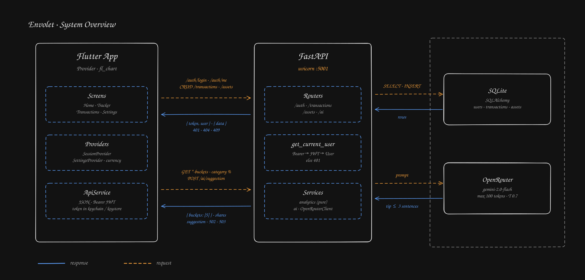
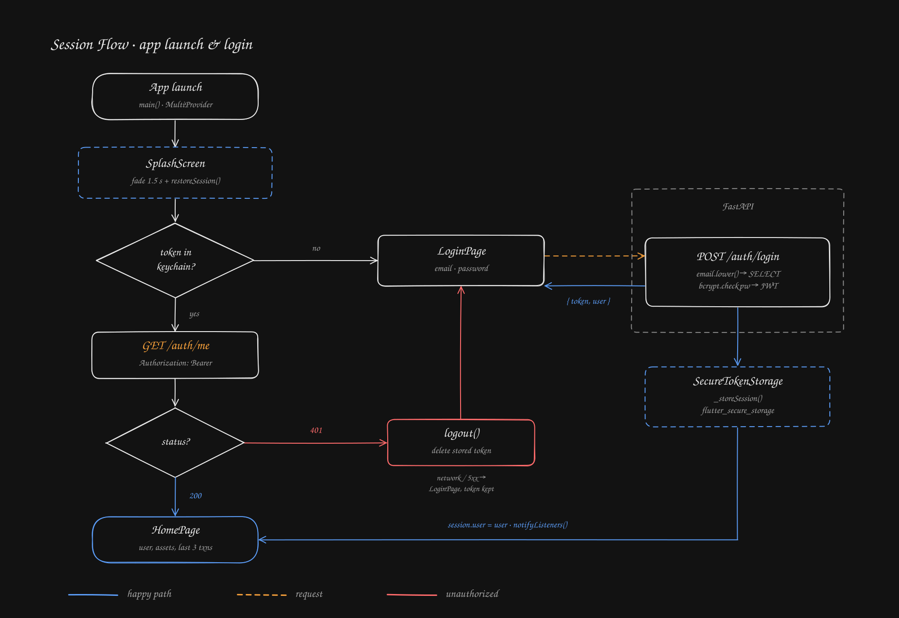
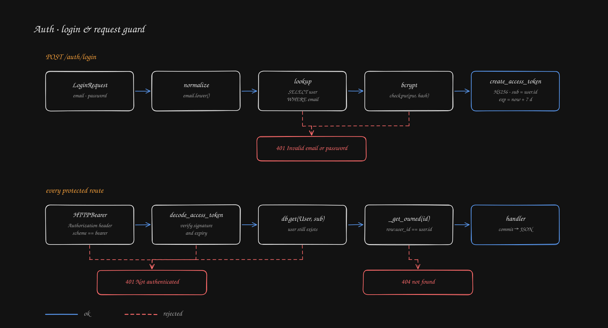
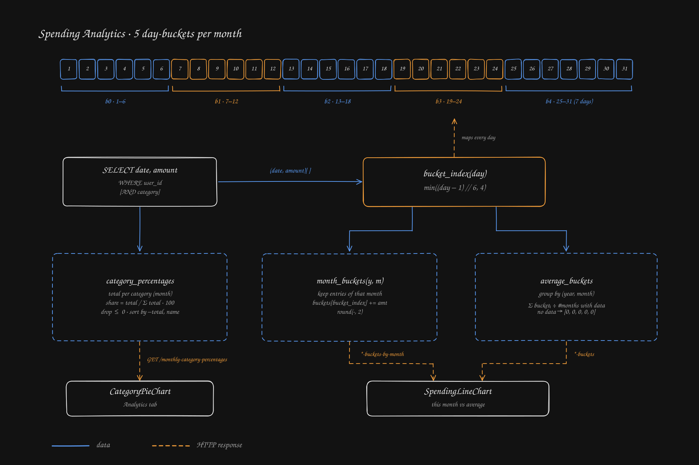
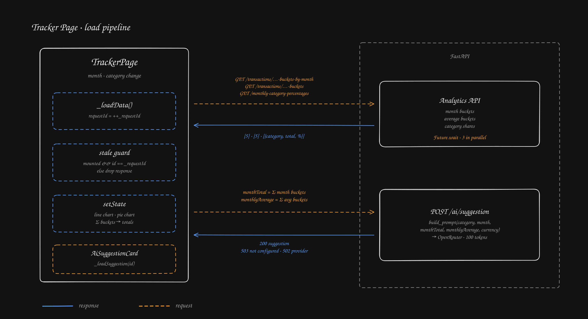

# Diagrams

Hand-drawn style diagrams of how Envolet works. They are generated from
[`generate.mjs`](generate.mjs), so edit the script instead of the SVGs:

```bash
node docs/diagrams/generate.mjs
```

The script has no dependencies. The embedded font is
[Virgil](https://github.com/excalidraw/virgil) from Excalidraw (SIL Open Font License).

## System overview



## Session flow

What happens on app launch and on login (`SplashScreen`, `SessionProvider`, `ApiService`).



## Auth pipeline

`POST /auth/login` and the `get_current_user` guard every protected route goes through.



## Spending analytics

How `app/services/analytics.py` splits a month into five day-buckets and what each endpoint returns.



## Tracker page

How `TrackerPage` loads its charts in parallel, drops stale responses and asks for an AI tip.


